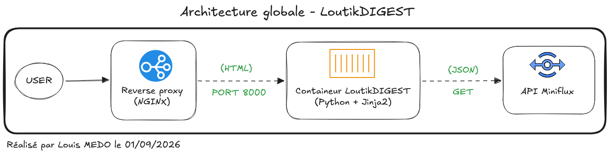
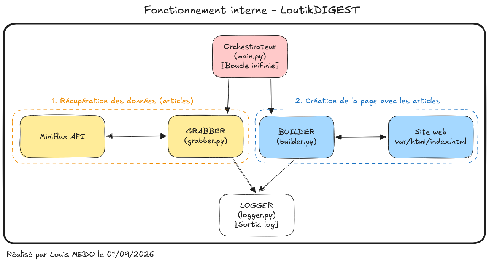

# About - LoutikDIGEST

## Qu'est-ce que LoutikDIGEST ?

LoutikDIGEST est un générateur de site statique (SSG) léger et autonome. Conçu spécifiquement pour le monde de l'infrastructure et de l'auto-hébergement, son rôle est d'agir comme une passerelle publique pour un agrégateur RSS privé. Il interroge une instance sécurisée, extrait les sources suivies ainsi que les derniers articles, et recompile le tout sous la forme d'une page web HTML responsive, accessible et prête à être servie par n'importe quel serveur web standard.

---

## Pourquoi avoir créé LoutikDIGEST ?

Au quotidien, j'utilise l'agrégateur RSS Miniflux pour centraliser et traiter ma veille technologique. C'est un outil minimaliste et redoutablement efficace en backend, mais il présente une limite stricte : il ne permet pas d'exposer publiquement et nativement ses flux à des visiteurs externes.

Cette limitation pose un problème direct dans le cadre de mon BTS SIO. Lors de l'épreuve orale E5, il est impératif de démontrer de manière concrète et transparente la méthode utilisée pour réaliser notre veille technologique, ainsi que les sources exploitées. Plutôt que de copier-coller manuellement ces informations sur un portfolio étudiant régulier — une tâche répétitive et chronophage — j'ai préféré appliquer la philosophie d'automatisation inhérente à l'administration système. LoutikDIGEST est né de ce besoin : automatiser la publication de ma veille métier en temps réel, sans aucune intervention manuelle de ma part après le déploiement initial.

---

## Comment cela fonctionne ?

### Architecture globale

*Figure 1 : Intégration de LoutikDIGEST dans une infrastructure web standard.*

**Explication de l'architecture globale :**
LoutikDIGEST est encapsulé dans un conteneur Docker léger exécuté sans privilèges (non-root). À intervalles réguliers, il initie une requête HTTPS vers l'API de l'instance Miniflux pour récupérer la matière brute. Une fois les données formatées et la page HTML générée physiquement dans un dossier interne, le conteneur expose ce fichier texte via un serveur HTTP natif ultra-minimaliste sur le port 8000. Un composant réseau externe (comme Traefik au sein d'un cluster ou un NGINX en frontal) se charge ensuite de router le trafic public et de sécuriser la connexion finale vers l'utilisateur.

### Fonctionnement interne (Logique Applicative)

*Figure 2 : Communication entre les modules internes de l'application Python.*

**Explication des modules internes :**

L'application respecte le principe de responsabilité unique (KISS) et se découpe en quatre modules distincts :

* **L'Orchestrateur (`main.py`) :** C'est le chef d'orchestre. Il lance le serveur web local dans un thread en arrière-plan (pour éviter le blocage) et exécute une boucle infinie cadencée par une variable d'environnement (`UPDATE_TIME`). À chaque cycle, il appelle les autres modules dans un ordre précis.
* **Le Collecteur (`grabber.py`) :** Son rôle est purement réseau. Il s'authentifie auprès de Miniflux, exécute les requêtes GET ciblées, vérifie les codes de retour HTTP (gestion des erreurs réseau) et renvoie des tableaux de données JSON propres à l'orchestrateur.
* **Le Constructeur (`builder.py`) :** Il récupère les données JSON et les fusionne avec un gabarit (`templates/index.html`) en utilisant le moteur de rendu Jinja2. Il effectue également les calculs de temps (date de dernière mise à jour) avant d'écrire le résultat final "en dur" sur le disque.
* **Le Journaliseur (`logger.py`) :** Importé par tous les autres fichiers, il intercepte les messages de débogage et d'erreur pour les formater proprement avec des horodatages. Il redirige tout vers la sortie standard (`stdout`), ce qui permet à l'infrastructure hôte de capturer facilement les logs du conteneur.